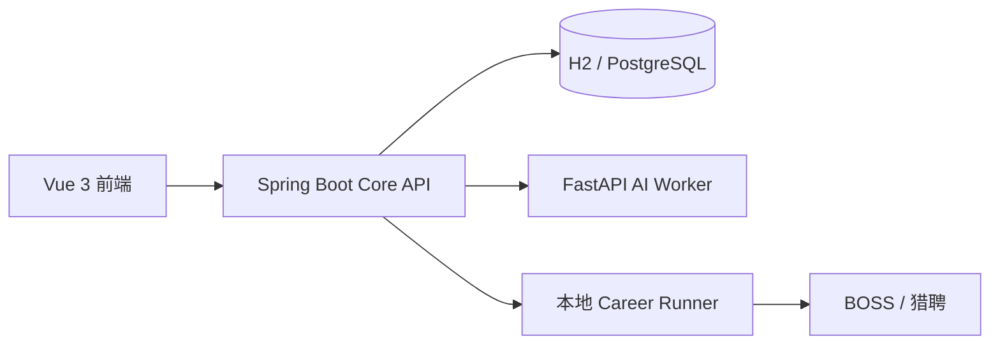

# CareerLens 职镜

面向个人使用的求职工作区，整合简历编辑、岗位匹配、优化建议和投递跟进。

使用 Vue 3 / TypeScript 构建界面，Spring Boot 3.4 / Java 21 管理业务，FastAPI 处理文档与评分，本地 Runner 负责招聘平台连接。

仓库提供脱敏源码、配置模板和合成测试数据。首次运行需要注册账号，创建或导入自己的简历；账号、岗位和投递记录从空状态开始。

## 主要功能

| 模块 | 功能 |
| --- | --- |
| 简历工作区 | 动态章节、自动保存、版本发布、历史比较与恢复、PDF 导出 |
| 文档导入 | TXT、PDF、DOCX 解析，字段来源追踪和人工确认 |
| 岗位匹配 | JD 要求提取、技能与经历证据匹配、评分和缺失项展示 |
| 优化建议 | 无 JD 草稿体检、按岗位定向优化、逐条审核和应用 |
| 岗位发现 | 关键词与薪资筛选、招聘者与公司过滤、可选通勤筛选 |
| 任务管理 | 审批、暂停、恢复、终止、执行状态持久化和结果核对 |
| 投递跟进 | 手动记录、阶段看板、时间线、后续行动和业务备份恢复 |

### 使用流程

1. 注册账号，创建或导入简历，核对解析结果。
2. 编辑并发布简历版本，选择目标岗位或录入 JD。
3. 查看匹配证据和优化建议，审核后应用到新版本。
4. 配置本地 Runner 后连接平台，发现并筛选岗位。
5. 审核岗位、简历版本和招呼语，再批准执行。
6. 核对执行结果，在投递看板中继续跟进。

## 系统组成



| 组件 | 职责 |
| --- | --- |
| Web | 简历编辑、匹配报告、审核和任务管理界面 |
| Core API | 账号隔离、业务数据、简历版本、审批及后台任务 |
| AI Worker | 文档解析、规则评分、优化建议和 PDF 生成 |
| Career Runner | 本机浏览器会话、平台适配、串行执行和回执核验 |
| 数据库 | Windows 本地模式使用 H2；Docker 模式使用 PostgreSQL |

Redis 随 Docker 环境提供，目前作为预留服务；后台任务通过数据库 Outbox 推进。

## 快速开始：Windows

### 环境要求

| 工具 | 要求 |
| --- | --- |
| Git | 用于下载仓库 |
| Node.js | 24 或更高版本；CI 使用 24 |
| Java | JDK 21；可通过 `JAVA_HOME` 指定安装目录 |
| Python | 3.11 或更高版本；CI 使用 3.12 |

首次启动需要联网安装 npm、Python 和 Maven 依赖。项目自带 Maven Wrapper，无需单独安装 Maven。

### 下载并启动

在希望存放项目的目录打开 PowerShell。只复制代码块内部的命令，不复制首尾的 Markdown 标记。

```powershell
git clone https://github.com/wWYANG666/BOSS.git
Set-Location .\BOSS
powershell -ExecutionPolicy Bypass -File .\scripts\start-dev.ps1 -OpenBrowser
```

如果已下载源码，进入项目根目录后只执行启动命令。根目录中应能看到 `package.json`、`scripts/` 和 `README.md`。

脚本会安装前端与 Runner 依赖、创建 Python 虚拟环境，并启动各个服务。默认使用本地 H2、离线规则和测试模式 Runner，可以先使用简历、JD 匹配与手动投递管理功能。

| 服务 | Windows 本地地址 |
| --- | --- |
| Web 界面 | [http://127.0.0.1:8888](http://127.0.0.1:8888) |
| Core API 文档 | [http://127.0.0.1:18080/swagger-ui.html](http://127.0.0.1:18080/swagger-ui.html) |
| AI Worker 文档 | [http://127.0.0.1:8001/docs](http://127.0.0.1:8001/docs) |
| Runner 健康检查 | [http://127.0.0.1:43120/health](http://127.0.0.1:43120/health) |

### 查看状态与停止服务

以下命令均在项目根目录执行：

```powershell
powershell -ExecutionPolicy Bypass -File .\scripts\start-dev.ps1 -Action status
powershell -ExecutionPolicy Bypass -File .\scripts\start-dev.ps1 -Action stop
```

也可以双击 `启动CareerLens.bat` 或 `停止CareerLens.bat`。当前启动批处理使用默认测试 Runner 模式。

安装过依赖后可使用 `-SkipInstall` 加快启动。修改服务环境变量后，需要先停止服务，再重新启动。

## Docker 启动

先安装并启动 Docker Engine / Docker Desktop。在项目根目录准备配置文件；已有 `.env` 时保留原配置：

```powershell
if (-not (Test-Path .env)) { Copy-Item .env.example .env }
```

编辑 `.env`，修改开发用数据库密码，并为 `RUNNER_APPROVAL_SECRET`、`RUNNER_ENCRYPTION_KEY` 配置相互独立、至少 32 个字符的随机值。然后启动：

```powershell
docker compose up --build -d
```

Docker 模式的 Web 地址是 [http://127.0.0.1](http://127.0.0.1)，Core API 文档仍位于 [18080 端口](http://127.0.0.1:18080/swagger-ui.html)。数据库及文件通过命名卷持久化。

```powershell
docker compose ps
docker compose logs --tail 100
docker compose down
```

Compose 中的 Runner 固定为 `fake`。真实工作区会拒绝测试模式的岗位和回执；真实 BOSS 浏览器执行需要 Windows 本机 Runner。

## 配置说明

Windows 启动脚本使用当前 PowerShell 的环境变量；普通 `.env` 文件不会自动为后端和 Runner 注入配置。Docker Compose 使用根目录 `.env` 进行变量替换。

| 变量 | 用途 |
| --- | --- |
| `RUNNER_APPROVAL_SECRET` | Runner 审批签名密钥；真实模式要求至少 32 个字符 |
| `RUNNER_ENCRYPTION_KEY` | Core 保存设备凭据的加密密钥；配对要求至少 32 个字符，并保持稳定 |
| `BROWSER_EXECUTABLE_PATH` | 可选的 Chrome / Edge 可执行文件路径 |
| `BOSS_BROWSER_MODE` | 默认 `auto`；登录使用可见窗口，正常执行使用后台浏览器 |
| `BOSS_CITY_CODES` | 可选的城市名称与平台编码映射；未识别城市时补充配置 |
| `AMAP_WEB_SERVICE_KEY` | 可选的高德 Web 服务密钥，用于地址解析与通勤计算 |
| `LIEPIN_MCP_TOKEN` | 猎聘 MCP 连接令牌 |
| `LLM_MODE` | 默认 `offline`；设为 `online` 启用在线优化建议 |
| `LLM_BASE_URL` | 在线模型 API 前缀，客户端会附加 `/chat/completions` |
| `LLM_API_KEY` / `LLM_MODEL` | 在线模型服务密钥与模型名称 |
| `PDF_FONT_PATH` | 可嵌入的中文 TTF / TTC 字体路径 |

配置模板见根目录及各服务目录下的 `.env.example`。模板中的开发密码与占位符需要按实际环境替换。

### 在线优化建议

默认使用本地规则，无需模型服务密钥。在线建议使用兼容 Chat Completions 和 JSON Schema 输出的模型服务，需要同时配置 `LLM_MODE=online`、`LLM_BASE_URL`、`LLM_API_KEY`、`LLM_MODEL`，再重启服务。

开启在线模式后，相关简历片段与岗位要求会发送给配置的模型服务。模型建议仍需用户核对；服务不可用或结果不合规时回退到离线规则。文档解析、规则评分和 PDF 生成仍在本地处理。

## 启用真实平台 Runner

完成首次本地启动并安装依赖后，再进行平台配置：

1. 配置两个相互独立的随机密钥：`RUNNER_APPROVAL_SECRET` 和 `RUNNER_ENCRYPTION_KEY`。
2. 停止默认服务，再使用真实 Runner 模式启动。
3. 读取本机配对文件中的码，在设置页完成设备配对。
4. 点击平台的“连接 / 检查”，完成浏览器登录和必要的人工验证。
5. 选择已发布且包含项目证据的简历，发现岗位并审核执行计划。

<details>
<summary>Windows 首次生成并保存随机密钥</summary>

仅首次配置时执行。已有密钥应继续使用；更换加密密钥会影响已保存设备凭据的解密。以下写法兼容 Windows PowerShell 5.1：

```powershell
function New-CareerLensSecret {
    $bytes = New-Object byte[] 32
    $rng = [Security.Cryptography.RandomNumberGenerator]::Create()
    try {
        $rng.GetBytes($bytes)
        [Convert]::ToBase64String($bytes)
    } finally {
        $rng.Dispose()
    }
}

$env:RUNNER_APPROVAL_SECRET = New-CareerLensSecret
$env:RUNNER_ENCRYPTION_KEY = New-CareerLensSecret
[Environment]::SetEnvironmentVariable('RUNNER_APPROVAL_SECRET', $env:RUNNER_APPROVAL_SECRET, 'User')
[Environment]::SetEnvironmentVariable('RUNNER_ENCRYPTION_KEY', $env:RUNNER_ENCRYPTION_KEY, 'User')
```

密钥保存在当前 Windows 用户的环境变量中，后续新开的终端可以读取。不要将生成的密钥加入版本库。

</details>

在已配置密钥的 PowerShell 中，从项目根目录执行：

```powershell
powershell -ExecutionPolicy Bypass -File .\scripts\start-dev.ps1 -Action stop
powershell -ExecutionPolicy Bypass -File .\scripts\start-dev.ps1 -RealRunner -SkipInstall -OpenBrowser
```

未配对的 Runner 会生成 `apps/career-runner/.runner-data/pairing.json`，配对码有效期为两分钟；过期时重启 Runner 生成新码。一个 Runner 绑定一个 Core 用户。

真实模式也支持从被 Git 忽略的 `apps/career-runner/.runner-data/start-real.env.cmd` 读取白名单配置；当前进程的环境变量优先。

### 平台行为与当前范围

- **BOSS**：发送审核后的招呼语并发起沟通，后续在手机端跟进；当前流程不自动发送简历附件或继续聊天。
- **猎聘**：通过 MCP 适配器使用平台侧简历，接口和回执仍需在实际账号中逐项验证。
- **人工处理**：登录、手机确认、验证码和平台页面变化可能需要用户处理。
- **结果核对**：无法确认发送结果时记录为未知结果，核对后再决定是否重试。
- **运行环境**：适合个人电脑或受控私有环境，Runner 默认只监听本机地址。

## 数据与隐私

| 内容 | 存储位置或方式 |
| --- | --- |
| Windows 本地数据库 | `services/core-api/data/careerlens.mv.db` |
| 浏览器会话、Runner 密钥与任务日志 | `apps/career-runner/.runner-data/` |
| Docker 数据 | PostgreSQL、Core、Runner 等命名卷 |
| 解析规则词典 | `services/ai-worker/app/data/skill_aliases.json`，随源码提供 |

仓库不包含真实简历、业务数据库、账号、投递记录、浏览器会话或实际密钥。测试文件使用合成资料。

JSON 业务备份包含简历、JD、报告和投递等业务记录；恢复目标必须是空账号。会话、设备凭据、活动任务命令和文件二进制不会随业务备份恢复。完整备份需同时保存数据库和产物文件。

`.gitignore` 已排除常见运行数据和敏感文件；请在提交前检查文件列表。上传说明见 [UPLOAD.md](UPLOAD.md)。

## 开发与验证

在项目根目录执行完整验证；`-SkipInstall` 适用于已安装依赖的环境：

```powershell
powershell -ExecutionPolicy Bypass -File .\scripts\verify.ps1 -SkipInstall
```

验证脚本覆盖前端构建、Core API 测试、AI Worker 测试与静态检查、Runner 测试、Compose 配置和隔离数据库下的浏览器流程。CI 定义见 [.github/workflows/ci.yml](.github/workflows/ci.yml)。

本次脱敏版本已通过简历解析回归测试 6 项、Core API 集成测试 23 项。其他验证记录和待验收项见 [docs/verification.md](docs/verification.md)。扫描 PDF 需要先进行 OCR；复杂文档、在线模型输出质量及真实平台兼容性仍需按实际输入验证。

## 项目目录

```text
src/                              Vue 界面与状态管理
services/core-api/                Spring Boot 业务 API 与数据库迁移
services/ai-worker/               FastAPI 解析、评分、建议与 PDF 服务
apps/career-runner/               本地平台 Runner
apps/careerlens-browser-extension/ BOSS 页面入口扩展
scripts/                          启动、验证与验收脚本
infra/                            Nginx 等基础配置
docs/                             实现记录、验收范围与参考资料
```

进一步阅读：[Core API](services/core-api/README.md) · [AI Worker](services/ai-worker/README.md) · [实现记录](docs/implementation-progress.md) · [参考项目](docs/open-source-references.md)。
